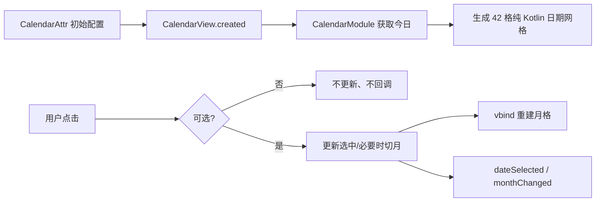

# 架构与 API 设计

## 目录

```text
KuiklyCalendar/src/commonMain/kotlin/com/kuikly/kuiklycalendar/
├── calendar/
│   ├── CalendarModels.kt   # 日期、月份、主题、标记、纯公历算法
│   └── CalendarView.kt     # ComposeView、Attr/Event、渲染与交互
└── CalendarDemoPage.kt     # 可运行中文 Demo（calendar_demo）
```

## 接入 API

```kotlin
Calendar {
    attr {
        initialMonth = CalendarMonth(2026, 7)
        selectedDate = CalendarDate(2026, 7, 15)
        minDate = CalendarDate(2026, 7, 3)
        maxDate = CalendarDate(2026, 9, 25)
        disabledDates = setOf(CalendarDate(2026, 7, 18))
        markers = mapOf(CalendarDate(2026, 7, 15) to CalendarMarker(listOf(0xFF22C55E)))
        showAdjacentMonths = true
    }
    event {
        dateSelected { date -> /* date 为无时区自然日 */ }
        monthChanged { month -> /* 年月发生改变 */ }
    }
}
```

入口是 `ViewContainer<*, *>.Calendar {}`，符合 Kuikly ComposeView 的声明式扩展习惯。

## 属性

| 属性 | 默认值 | 说明 |
| --- | --- | --- |
| `width` | 页面宽度 | 组件宽度 |
| `initialMonth` | 当前月 | 首次显示月 |
| `selectedDate` | `null` | 首次选中日期 |
| `minDate` / `maxDate` | `null` | 可选日期和可进入月份的边界 |
| `disabledDates` | 空集合 | 明确禁用日期 |
| `isDateSelectable` | `null` | 业务禁用谓词，适合节假日/库存判断 |
| `markers` | 空 Map | 日期对应的单个提示点 |
| `showAdjacentMonths` | `false` | 是否显示、可点击相邻月日期 |
| `firstDayOfWeek` | `MONDAY` | 一周首日 |
| `weekdayLabels` | 日～六 | 本地化星期标题 |
| `theme` | `CalendarTheme()` | 全量色彩主题 |
| `dayContent` | `null` | 日期内容插槽，外层交互逻辑保持不变 |

## 事件与命令式 API

- `dateSelected: (CalendarDate) -> Unit`：用户实际点击可选日期时触发。
- `monthChanged: (CalendarMonth) -> Unit`：用户切月或点相邻月日期造成月份改变时触发。
- `showMonth(month)`、`showToday()`、`select(date)`：捕获 `CalendarView` 引用后可调用；`select` 是静默程序性同步，不重复派发用户回调。
- `currentMonth()`、`currentSelection()`：读取当前内部状态。

## 状态流



## 兼容策略

本次新增为独立包和新路由，不修改现有公开类或原生桥。后续添加范围/多选时新增类型和属性，不改变 `CalendarDate`、单选回调签名或默认主题。
